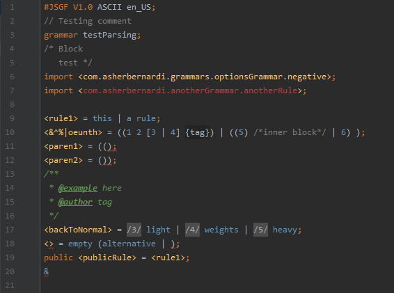

# jsgfplugin

A plugin for Intellij IDEA to support the JSpeech Grammar Format.  
Specifications were development based on this documentation: http://java.coe.psu.ac.th/Extension/JavaSpeech1.0/JSGF.pdf

Plugin page: https://plugins.jetbrains.com/plugin/14099-jsgf

## Installation

In Intellij go to "Settings > Plugins", click the "Marketplace" tab, and type "jsgf" into the search bar.
The Jsgf plugin should be the first option.  
Click install, then restart your IDE.

_NOTE:_ You must have Intellij installed with version between 2019.3.3 and 2020.3, otherwise the plugin may not show up in Marketplace.

## What this plugin supports

- syntax highlighting
- syntax error checking
- semantic error checking
- go to declaration
- find usages
- automatic renaming
- parenthesis, bracket, brace, and angle bracket matching
- search for symbol includes all declared rule names
- view structure
- code completion
- automatic formatting



## Importing rules

This plugin supports importing rules from other files.
This can be done in two ways, by using the fully qualified grammar name, or by using directories.

#### By using the grammar name

If you import a rule with a statement such as

```
import <com.asherbernardi.jsgf.grams.OptionsGrammar.optionOne>;
```

the plugin will search through the entire module to find all JSGF files to match the fully qualified name declared in the beginning of the grammar with `com.asherbernardi.jsgf.grams.OptionsGrammar`.
That is, it will look for a file with

```
grammar com.asherbernardi.jsgf.grams.OptionsGrammar;
```

declared in the heading. Then, it will search for a _public_ rule in that file called `<optionOne>`. If it cannot find the file or cannot find the rule in that file, the import statement will be highlighted red as a broken link.

#### By using the directory

If you import a rule with a statement such as

```
import <resources.myGrammars.common.PopularPhrases.*>
```

the plugin will search through the entire module to find all JSGF files with the file name "PopularPhrases.jsgf" which reside in a directory with a path that ends with `/resources/myGrammars/common/` and will import all public rules from that grammar.
If there are no files in a suitable directory (or multiple files), the import statement will be highlighted red as a broken link.

